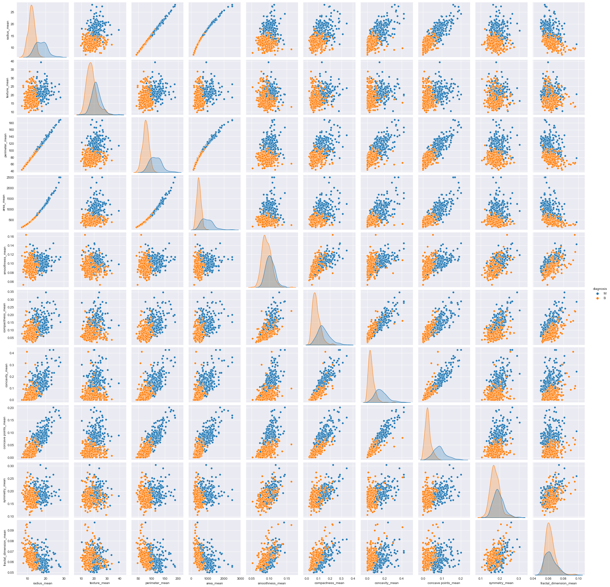
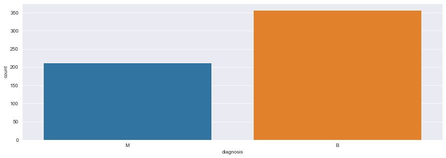
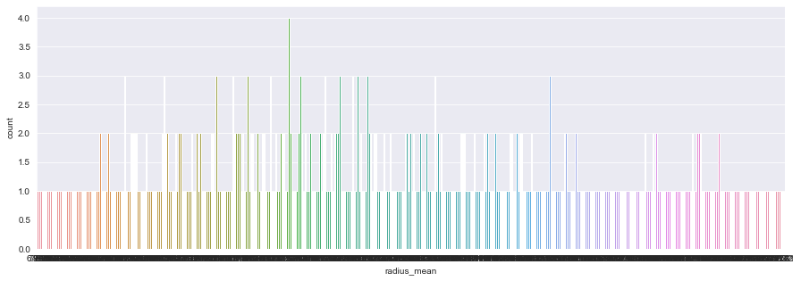
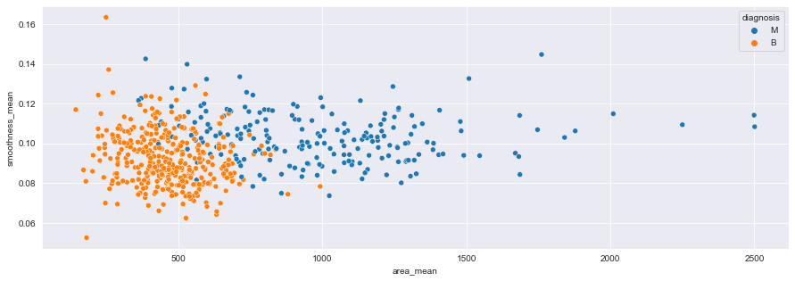
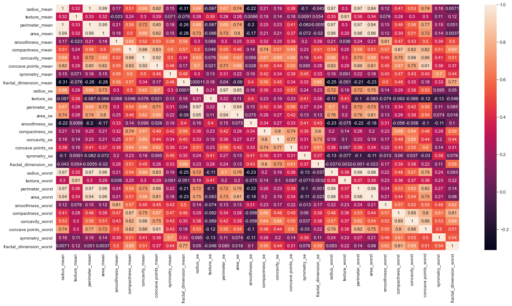

# Prediciting Breast Cancer Diagnosis with SVM and Hyperparameter Tuning  

* by Morrison Fowlks


```python
import numpy as np
import pandas as pd
import matplotlib.pyplot as plt
import seaborn as sns
```


```python
from matplotlib import rcParams
rcParams['figure.figsize'] = 15, 5
sns.set_style('darkgrid')
```


```python
breast_cancer_df = pd.read_csv('data.csv')
breast_cancer_df.head()
```


<div>
<style scoped>
    .dataframe tbody tr th:only-of-type {
        vertical-align: middle;
    }

    .dataframe tbody tr th {
        vertical-align: top;
    }

    .dataframe thead th {
        text-align: right;
    }
</style>
<table border="1" class="dataframe">
  <thead>
    <tr style="text-align: right;">
      <th></th>
      <th>id</th>
      <th>diagnosis</th>
      <th>radius_mean</th>
      <th>texture_mean</th>
      <th>perimeter_mean</th>
      <th>area_mean</th>
      <th>smoothness_mean</th>
      <th>compactness_mean</th>
      <th>concavity_mean</th>
      <th>concave points_mean</th>
      <th>...</th>
      <th>texture_worst</th>
      <th>perimeter_worst</th>
      <th>area_worst</th>
      <th>smoothness_worst</th>
      <th>compactness_worst</th>
      <th>concavity_worst</th>
      <th>concave points_worst</th>
      <th>symmetry_worst</th>
      <th>fractal_dimension_worst</th>
      <th>Unnamed: 32</th>
    </tr>
  </thead>
  <tbody>
    <tr>
      <th>0</th>
      <td>842302</td>
      <td>M</td>
      <td>17.99</td>
      <td>10.38</td>
      <td>122.80</td>
      <td>1001.0</td>
      <td>0.11840</td>
      <td>0.27760</td>
      <td>0.3001</td>
      <td>0.14710</td>
      <td>...</td>
      <td>17.33</td>
      <td>184.60</td>
      <td>2019.0</td>
      <td>0.1622</td>
      <td>0.6656</td>
      <td>0.7119</td>
      <td>0.2654</td>
      <td>0.4601</td>
      <td>0.11890</td>
      <td>NaN</td>
    </tr>
    <tr>
      <th>1</th>
      <td>842517</td>
      <td>M</td>
      <td>20.57</td>
      <td>17.77</td>
      <td>132.90</td>
      <td>1326.0</td>
      <td>0.08474</td>
      <td>0.07864</td>
      <td>0.0869</td>
      <td>0.07017</td>
      <td>...</td>
      <td>23.41</td>
      <td>158.80</td>
      <td>1956.0</td>
      <td>0.1238</td>
      <td>0.1866</td>
      <td>0.2416</td>
      <td>0.1860</td>
      <td>0.2750</td>
      <td>0.08902</td>
      <td>NaN</td>
    </tr>
    <tr>
      <th>2</th>
      <td>84300903</td>
      <td>M</td>
      <td>19.69</td>
      <td>21.25</td>
      <td>130.00</td>
      <td>1203.0</td>
      <td>0.10960</td>
      <td>0.15990</td>
      <td>0.1974</td>
      <td>0.12790</td>
      <td>...</td>
      <td>25.53</td>
      <td>152.50</td>
      <td>1709.0</td>
      <td>0.1444</td>
      <td>0.4245</td>
      <td>0.4504</td>
      <td>0.2430</td>
      <td>0.3613</td>
      <td>0.08758</td>
      <td>NaN</td>
    </tr>
    <tr>
      <th>3</th>
      <td>84348301</td>
      <td>M</td>
      <td>11.42</td>
      <td>20.38</td>
      <td>77.58</td>
      <td>386.1</td>
      <td>0.14250</td>
      <td>0.28390</td>
      <td>0.2414</td>
      <td>0.10520</td>
      <td>...</td>
      <td>26.50</td>
      <td>98.87</td>
      <td>567.7</td>
      <td>0.2098</td>
      <td>0.8663</td>
      <td>0.6869</td>
      <td>0.2575</td>
      <td>0.6638</td>
      <td>0.17300</td>
      <td>NaN</td>
    </tr>
    <tr>
      <th>4</th>
      <td>84358402</td>
      <td>M</td>
      <td>20.29</td>
      <td>14.34</td>
      <td>135.10</td>
      <td>1297.0</td>
      <td>0.10030</td>
      <td>0.13280</td>
      <td>0.1980</td>
      <td>0.10430</td>
      <td>...</td>
      <td>16.67</td>
      <td>152.20</td>
      <td>1575.0</td>
      <td>0.1374</td>
      <td>0.2050</td>
      <td>0.4000</td>
      <td>0.1625</td>
      <td>0.2364</td>
      <td>0.07678</td>
      <td>NaN</td>
    </tr>
  </tbody>
</table>
<p>5 rows × 33 columns</p>
</div>


```python
breast_cancer_df.drop(labels=['Unnamed: 32', 'id'], axis=1, inplace=True)
```


```python
breast_cancer_df.info()
```

    <class 'pandas.core.frame.DataFrame'>
    RangeIndex: 569 entries, 0 to 568
    Data columns (total 31 columns):
     #   Column                   Non-Null Count  Dtype  
    ---  ------                   --------------  -----  
     0   diagnosis                569 non-null    object 
     1   radius_mean              569 non-null    float64
     2   texture_mean             569 non-null    float64
     3   perimeter_mean           569 non-null    float64
     4   area_mean                569 non-null    float64
     5   smoothness_mean          569 non-null    float64
     6   compactness_mean         569 non-null    float64
     7   concavity_mean           569 non-null    float64
     8   concave points_mean      569 non-null    float64
     9   symmetry_mean            569 non-null    float64
     10  fractal_dimension_mean   569 non-null    float64
     11  radius_se                569 non-null    float64
     12  texture_se               569 non-null    float64
     13  perimeter_se             569 non-null    float64
     14  area_se                  569 non-null    float64
     15  smoothness_se            569 non-null    float64
     16  compactness_se           569 non-null    float64
     17  concavity_se             569 non-null    float64
     18  concave points_se        569 non-null    float64
     19  symmetry_se              569 non-null    float64
     20  fractal_dimension_se     569 non-null    float64
     21  radius_worst             569 non-null    float64
     22  texture_worst            569 non-null    float64
     23  perimeter_worst          569 non-null    float64
     24  area_worst               569 non-null    float64
     25  smoothness_worst         569 non-null    float64
     26  compactness_worst        569 non-null    float64
     27  concavity_worst          569 non-null    float64
     28  concave points_worst     569 non-null    float64
     29  symmetry_worst           569 non-null    float64
     30  fractal_dimension_worst  569 non-null    float64
    dtypes: float64(30), object(1)
    memory usage: 137.9+ KB
    


```python
sns.pairplot(breast_cancer_df, hue='diagnosis', vars=['radius_mean', 'texture_mean', 'perimeter_mean', 'area_mean', 
                                     'smoothness_mean', 'compactness_mean', 'concavity_mean',
                                     'concave points_mean', 'symmetry_mean', 'fractal_dimension_mean'])
plt.show()
```


    

    


There's a pretty good distinction between the diagnosis (blue & orange) in most of the variables seen above.


```python
sns.countplot(x=breast_cancer_df['diagnosis'])
plt.show()
```


    

    


As seen above, the majority of data observations are benign. 


```python
sns.countplot(x=breast_cancer_df['radius_mean'])
plt.show()
```


    

    


```python
sns.scatterplot(x = 'area_mean', y = 'smoothness_mean', hue = 'diagnosis', data = breast_cancer_df)
plt.show()
```


    

    


```python
plt.figure(figsize=(20,10)) 
sns.heatmap(breast_cancer_df.corr(), annot=True) 
plt.show()
```


    

    


Many strong correlations are present in this heatmap


```python
from sklearn.preprocessing import StandardScaler

X = breast_cancer_df.drop('diagnosis', axis=1)
y = breast_cancer_df['diagnosis']

scaler = StandardScaler()
X_scaled = scaler.fit_transform(X)
X = pd.DataFrame(data=X_scaled, columns=X.columns)
```


```python
X.head()
```


<div>
<style scoped>
    .dataframe tbody tr th:only-of-type {
        vertical-align: middle;
    }

    .dataframe tbody tr th {
        vertical-align: top;
    }

    .dataframe thead th {
        text-align: right;
    }
</style>
<table border="1" class="dataframe">
  <thead>
    <tr style="text-align: right;">
      <th></th>
      <th>radius_mean</th>
      <th>texture_mean</th>
      <th>perimeter_mean</th>
      <th>area_mean</th>
      <th>smoothness_mean</th>
      <th>compactness_mean</th>
      <th>concavity_mean</th>
      <th>concave points_mean</th>
      <th>symmetry_mean</th>
      <th>fractal_dimension_mean</th>
      <th>...</th>
      <th>radius_worst</th>
      <th>texture_worst</th>
      <th>perimeter_worst</th>
      <th>area_worst</th>
      <th>smoothness_worst</th>
      <th>compactness_worst</th>
      <th>concavity_worst</th>
      <th>concave points_worst</th>
      <th>symmetry_worst</th>
      <th>fractal_dimension_worst</th>
    </tr>
  </thead>
  <tbody>
    <tr>
      <th>0</th>
      <td>1.097064</td>
      <td>-2.073335</td>
      <td>1.269934</td>
      <td>0.984375</td>
      <td>1.568466</td>
      <td>3.283515</td>
      <td>2.652874</td>
      <td>2.532475</td>
      <td>2.217515</td>
      <td>2.255747</td>
      <td>...</td>
      <td>1.886690</td>
      <td>-1.359293</td>
      <td>2.303601</td>
      <td>2.001237</td>
      <td>1.307686</td>
      <td>2.616665</td>
      <td>2.109526</td>
      <td>2.296076</td>
      <td>2.750622</td>
      <td>1.937015</td>
    </tr>
    <tr>
      <th>1</th>
      <td>1.829821</td>
      <td>-0.353632</td>
      <td>1.685955</td>
      <td>1.908708</td>
      <td>-0.826962</td>
      <td>-0.487072</td>
      <td>-0.023846</td>
      <td>0.548144</td>
      <td>0.001392</td>
      <td>-0.868652</td>
      <td>...</td>
      <td>1.805927</td>
      <td>-0.369203</td>
      <td>1.535126</td>
      <td>1.890489</td>
      <td>-0.375612</td>
      <td>-0.430444</td>
      <td>-0.146749</td>
      <td>1.087084</td>
      <td>-0.243890</td>
      <td>0.281190</td>
    </tr>
    <tr>
      <th>2</th>
      <td>1.579888</td>
      <td>0.456187</td>
      <td>1.566503</td>
      <td>1.558884</td>
      <td>0.942210</td>
      <td>1.052926</td>
      <td>1.363478</td>
      <td>2.037231</td>
      <td>0.939685</td>
      <td>-0.398008</td>
      <td>...</td>
      <td>1.511870</td>
      <td>-0.023974</td>
      <td>1.347475</td>
      <td>1.456285</td>
      <td>0.527407</td>
      <td>1.082932</td>
      <td>0.854974</td>
      <td>1.955000</td>
      <td>1.152255</td>
      <td>0.201391</td>
    </tr>
    <tr>
      <th>3</th>
      <td>-0.768909</td>
      <td>0.253732</td>
      <td>-0.592687</td>
      <td>-0.764464</td>
      <td>3.283553</td>
      <td>3.402909</td>
      <td>1.915897</td>
      <td>1.451707</td>
      <td>2.867383</td>
      <td>4.910919</td>
      <td>...</td>
      <td>-0.281464</td>
      <td>0.133984</td>
      <td>-0.249939</td>
      <td>-0.550021</td>
      <td>3.394275</td>
      <td>3.893397</td>
      <td>1.989588</td>
      <td>2.175786</td>
      <td>6.046041</td>
      <td>4.935010</td>
    </tr>
    <tr>
      <th>4</th>
      <td>1.750297</td>
      <td>-1.151816</td>
      <td>1.776573</td>
      <td>1.826229</td>
      <td>0.280372</td>
      <td>0.539340</td>
      <td>1.371011</td>
      <td>1.428493</td>
      <td>-0.009560</td>
      <td>-0.562450</td>
      <td>...</td>
      <td>1.298575</td>
      <td>-1.466770</td>
      <td>1.338539</td>
      <td>1.220724</td>
      <td>0.220556</td>
      <td>-0.313395</td>
      <td>0.613179</td>
      <td>0.729259</td>
      <td>-0.868353</td>
      <td>-0.397100</td>
    </tr>
  </tbody>
</table>
<p>5 rows × 30 columns</p>
</div>


## Creating the Model


```python
from sklearn.model_selection import train_test_split
X_train, X_test, y_train, y_test = train_test_split(X, y, test_size=0.3, random_state=101)
```


```python
from sklearn.svm import SVC

model = SVC()
model.fit(X_train,y_train)
```


    SVC()


```python
predictions = model.predict(X_test)
```


```python
from sklearn.metrics import confusion_matrix

cm = confusion_matrix(y_test, predictions)

print('Confusion matrix\n\n', cm)
print('\nTrue Positives(TP) = ', cm[0,0])
print('\nTrue Negatives(TN) = ', cm[1,1])
print('\nFalse Positives(FP) = ', cm[0,1])
print('\nFalse Negatives(FN) = ', cm[1,0])
```

    Confusion matrix
    
     [[104   1]
     [  3  63]]
    
    True Positives(TP) =  104
    
    True Negatives(TN) =  63
    
    False Positives(FP) =  1
    
    False Negatives(FN) =  3
    


```python
from sklearn.metrics import classification_report

print(classification_report(y_test,predictions))
```

                  precision    recall  f1-score   support
    
               B       0.97      0.99      0.98       105
               M       0.98      0.95      0.97        66
    
        accuracy                           0.98       171
       macro avg       0.98      0.97      0.98       171
    weighted avg       0.98      0.98      0.98       171
    
    

### Hyperparameter Tuning


```python
param_grid = {'C': [0.1,1, 10, 100, 1000], 'gamma': [1,0.1,0.01,0.001,0.0001], 'kernel': ['rbf']} 
```


```python
from sklearn.model_selection import GridSearchCV

grid = GridSearchCV(SVC(),param_grid,refit=True,verbose=3)
```


```python
grid.fit(X_train,y_train)
```

    Fitting 5 folds for each of 25 candidates, totalling 125 fits
    [CV 1/5] END .....................C=0.1, gamma=1, kernel=rbf; total time=   0.0s
    [CV 2/5] END .....................C=0.1, gamma=1, kernel=rbf; total time=   0.0s
    [CV 3/5] END .....................C=0.1, gamma=1, kernel=rbf; total time=   0.0s
    [CV 4/5] END .....................C=0.1, gamma=1, kernel=rbf; total time=   0.0s
    [CV 5/5] END .....................C=0.1, gamma=1, kernel=rbf; total time=   0.0s
    [CV 1/5] END ...................C=0.1, gamma=0.1, kernel=rbf; total time=   0.0s
    [CV 2/5] END ...................C=0.1, gamma=0.1, kernel=rbf; total time=   0.0s
    [CV 3/5] END ...................C=0.1, gamma=0.1, kernel=rbf; total time=   0.0s
    [CV 4/5] END ...................C=0.1, gamma=0.1, kernel=rbf; total time=   0.0s
    [CV 5/5] END ...................C=0.1, gamma=0.1, kernel=rbf; total time=   0.0s
    [CV 1/5] END ..................C=0.1, gamma=0.01, kernel=rbf; total time=   0.0s
    [CV 2/5] END ..................C=0.1, gamma=0.01, kernel=rbf; total time=   0.0s
    [CV 3/5] END ..................C=0.1, gamma=0.01, kernel=rbf; total time=   0.0s
    [CV 4/5] END ..................C=0.1, gamma=0.01, kernel=rbf; total time=   0.0s
    [CV 5/5] END ..................C=0.1, gamma=0.01, kernel=rbf; total time=   0.0s
    [CV 1/5] END .................C=0.1, gamma=0.001, kernel=rbf; total time=   0.0s
    [CV 2/5] END .................C=0.1, gamma=0.001, kernel=rbf; total time=   0.0s
    [CV 3/5] END .................C=0.1, gamma=0.001, kernel=rbf; total time=   0.0s
    [CV 4/5] END .................C=0.1, gamma=0.001, kernel=rbf; total time=   0.0s
    [CV 5/5] END .................C=0.1, gamma=0.001, kernel=rbf; total time=   0.0s
    [CV 1/5] END ................C=0.1, gamma=0.0001, kernel=rbf; total time=   0.0s
    [CV 2/5] END ................C=0.1, gamma=0.0001, kernel=rbf; total time=   0.0s
    [CV 3/5] END ................C=0.1, gamma=0.0001, kernel=rbf; total time=   0.0s
    [CV 4/5] END ................C=0.1, gamma=0.0001, kernel=rbf; total time=   0.0s
    [CV 5/5] END ................C=0.1, gamma=0.0001, kernel=rbf; total time=   0.0s
    [CV 1/5] END .......................C=1, gamma=1, kernel=rbf; total time=   0.0s
    [CV 2/5] END .......................C=1, gamma=1, kernel=rbf; total time=   0.0s
    [CV 3/5] END .......................C=1, gamma=1, kernel=rbf; total time=   0.0s
    [CV 4/5] END .......................C=1, gamma=1, kernel=rbf; total time=   0.0s
    [CV 5/5] END .......................C=1, gamma=1, kernel=rbf; total time=   0.0s
    [CV 1/5] END .....................C=1, gamma=0.1, kernel=rbf; total time=   0.0s
    [CV 2/5] END .....................C=1, gamma=0.1, kernel=rbf; total time=   0.0s
    [CV 3/5] END .....................C=1, gamma=0.1, kernel=rbf; total time=   0.0s
    [CV 4/5] END .....................C=1, gamma=0.1, kernel=rbf; total time=   0.0s
    [CV 5/5] END .....................C=1, gamma=0.1, kernel=rbf; total time=   0.0s
    [CV 1/5] END ....................C=1, gamma=0.01, kernel=rbf; total time=   0.0s
    [CV 2/5] END ....................C=1, gamma=0.01, kernel=rbf; total time=   0.0s
    [CV 3/5] END ....................C=1, gamma=0.01, kernel=rbf; total time=   0.0s
    [CV 4/5] END ....................C=1, gamma=0.01, kernel=rbf; total time=   0.0s
    [CV 5/5] END ....................C=1, gamma=0.01, kernel=rbf; total time=   0.0s
    [CV 1/5] END ...................C=1, gamma=0.001, kernel=rbf; total time=   0.0s
    [CV 2/5] END ...................C=1, gamma=0.001, kernel=rbf; total time=   0.0s
    [CV 3/5] END ...................C=1, gamma=0.001, kernel=rbf; total time=   0.0s
    [CV 4/5] END ...................C=1, gamma=0.001, kernel=rbf; total time=   0.0s
    [CV 5/5] END ...................C=1, gamma=0.001, kernel=rbf; total time=   0.0s
    [CV 1/5] END ..................C=1, gamma=0.0001, kernel=rbf; total time=   0.0s
    [CV 2/5] END ..................C=1, gamma=0.0001, kernel=rbf; total time=   0.0s
    [CV 3/5] END ..................C=1, gamma=0.0001, kernel=rbf; total time=   0.0s
    [CV 4/5] END ..................C=1, gamma=0.0001, kernel=rbf; total time=   0.0s
    [CV 5/5] END ..................C=1, gamma=0.0001, kernel=rbf; total time=   0.0s
    [CV 1/5] END ......................C=10, gamma=1, kernel=rbf; total time=   0.0s
    [CV 2/5] END ......................C=10, gamma=1, kernel=rbf; total time=   0.0s
    [CV 3/5] END ......................C=10, gamma=1, kernel=rbf; total time=   0.0s
    [CV 4/5] END ......................C=10, gamma=1, kernel=rbf; total time=   0.0s
    [CV 5/5] END ......................C=10, gamma=1, kernel=rbf; total time=   0.0s
    [CV 1/5] END ....................C=10, gamma=0.1, kernel=rbf; total time=   0.0s
    [CV 2/5] END ....................C=10, gamma=0.1, kernel=rbf; total time=   0.0s
    [CV 3/5] END ....................C=10, gamma=0.1, kernel=rbf; total time=   0.0s
    [CV 4/5] END ....................C=10, gamma=0.1, kernel=rbf; total time=   0.0s
    [CV 5/5] END ....................C=10, gamma=0.1, kernel=rbf; total time=   0.0s
    [CV 1/5] END ...................C=10, gamma=0.01, kernel=rbf; total time=   0.0s
    [CV 2/5] END ...................C=10, gamma=0.01, kernel=rbf; total time=   0.0s
    [CV 3/5] END ...................C=10, gamma=0.01, kernel=rbf; total time=   0.0s
    [CV 4/5] END ...................C=10, gamma=0.01, kernel=rbf; total time=   0.0s
    [CV 5/5] END ...................C=10, gamma=0.01, kernel=rbf; total time=   0.0s
    [CV 1/5] END ..................C=10, gamma=0.001, kernel=rbf; total time=   0.0s
    [CV 2/5] END ..................C=10, gamma=0.001, kernel=rbf; total time=   0.0s
    [CV 3/5] END ..................C=10, gamma=0.001, kernel=rbf; total time=   0.0s
    [CV 4/5] END ..................C=10, gamma=0.001, kernel=rbf; total time=   0.0s
    [CV 5/5] END ..................C=10, gamma=0.001, kernel=rbf; total time=   0.0s
    [CV 1/5] END .................C=10, gamma=0.0001, kernel=rbf; total time=   0.0s
    [CV 2/5] END .................C=10, gamma=0.0001, kernel=rbf; total time=   0.0s
    [CV 3/5] END .................C=10, gamma=0.0001, kernel=rbf; total time=   0.0s
    [CV 4/5] END .................C=10, gamma=0.0001, kernel=rbf; total time=   0.0s
    [CV 5/5] END .................C=10, gamma=0.0001, kernel=rbf; total time=   0.0s
    [CV 1/5] END .....................C=100, gamma=1, kernel=rbf; total time=   0.0s
    [CV 2/5] END .....................C=100, gamma=1, kernel=rbf; total time=   0.0s
    [CV 3/5] END .....................C=100, gamma=1, kernel=rbf; total time=   0.0s
    [CV 4/5] END .....................C=100, gamma=1, kernel=rbf; total time=   0.0s
    [CV 5/5] END .....................C=100, gamma=1, kernel=rbf; total time=   0.0s
    [CV 1/5] END ...................C=100, gamma=0.1, kernel=rbf; total time=   0.0s
    [CV 2/5] END ...................C=100, gamma=0.1, kernel=rbf; total time=   0.0s
    [CV 3/5] END ...................C=100, gamma=0.1, kernel=rbf; total time=   0.0s
    [CV 4/5] END ...................C=100, gamma=0.1, kernel=rbf; total time=   0.0s
    [CV 5/5] END ...................C=100, gamma=0.1, kernel=rbf; total time=   0.0s
    [CV 1/5] END ..................C=100, gamma=0.01, kernel=rbf; total time=   0.0s
    [CV 2/5] END ..................C=100, gamma=0.01, kernel=rbf; total time=   0.0s
    [CV 3/5] END ..................C=100, gamma=0.01, kernel=rbf; total time=   0.0s
    [CV 4/5] END ..................C=100, gamma=0.01, kernel=rbf; total time=   0.0s
    [CV 5/5] END ..................C=100, gamma=0.01, kernel=rbf; total time=   0.0s
    [CV 1/5] END .................C=100, gamma=0.001, kernel=rbf; total time=   0.0s
    [CV 2/5] END .................C=100, gamma=0.001, kernel=rbf; total time=   0.0s
    [CV 3/5] END .................C=100, gamma=0.001, kernel=rbf; total time=   0.0s
    [CV 4/5] END .................C=100, gamma=0.001, kernel=rbf; total time=   0.0s
    [CV 5/5] END .................C=100, gamma=0.001, kernel=rbf; total time=   0.0s
    [CV 1/5] END ................C=100, gamma=0.0001, kernel=rbf; total time=   0.0s
    [CV 2/5] END ................C=100, gamma=0.0001, kernel=rbf; total time=   0.0s
    [CV 3/5] END ................C=100, gamma=0.0001, kernel=rbf; total time=   0.0s
    [CV 4/5] END ................C=100, gamma=0.0001, kernel=rbf; total time=   0.0s
    [CV 5/5] END ................C=100, gamma=0.0001, kernel=rbf; total time=   0.0s
    [CV 1/5] END ....................C=1000, gamma=1, kernel=rbf; total time=   0.0s
    [CV 2/5] END ....................C=1000, gamma=1, kernel=rbf; total time=   0.0s
    [CV 3/5] END ....................C=1000, gamma=1, kernel=rbf; total time=   0.0s
    [CV 4/5] END ....................C=1000, gamma=1, kernel=rbf; total time=   0.0s
    [CV 5/5] END ....................C=1000, gamma=1, kernel=rbf; total time=   0.0s
    [CV 1/5] END ..................C=1000, gamma=0.1, kernel=rbf; total time=   0.0s
    [CV 2/5] END ..................C=1000, gamma=0.1, kernel=rbf; total time=   0.0s
    [CV 3/5] END ..................C=1000, gamma=0.1, kernel=rbf; total time=   0.0s
    [CV 4/5] END ..................C=1000, gamma=0.1, kernel=rbf; total time=   0.0s
    [CV 5/5] END ..................C=1000, gamma=0.1, kernel=rbf; total time=   0.0s
    [CV 1/5] END .................C=1000, gamma=0.01, kernel=rbf; total time=   0.0s
    [CV 2/5] END .................C=1000, gamma=0.01, kernel=rbf; total time=   0.0s
    [CV 3/5] END .................C=1000, gamma=0.01, kernel=rbf; total time=   0.0s
    [CV 4/5] END .................C=1000, gamma=0.01, kernel=rbf; total time=   0.0s
    [CV 5/5] END .................C=1000, gamma=0.01, kernel=rbf; total time=   0.0s
    [CV 1/5] END ................C=1000, gamma=0.001, kernel=rbf; total time=   0.0s
    [CV 2/5] END ................C=1000, gamma=0.001, kernel=rbf; total time=   0.0s
    [CV 3/5] END ................C=1000, gamma=0.001, kernel=rbf; total time=   0.0s
    [CV 4/5] END ................C=1000, gamma=0.001, kernel=rbf; total time=   0.0s
    [CV 5/5] END ................C=1000, gamma=0.001, kernel=rbf; total time=   0.0s
    [CV 1/5] END ...............C=1000, gamma=0.0001, kernel=rbf; total time=   0.0s
    [CV 2/5] END ...............C=1000, gamma=0.0001, kernel=rbf; total time=   0.0s
    [CV 3/5] END ...............C=1000, gamma=0.0001, kernel=rbf; total time=   0.0s
    [CV 4/5] END ...............C=1000, gamma=0.0001, kernel=rbf; total time=   0.0s
    [CV 5/5] END ...............C=1000, gamma=0.0001, kernel=rbf; total time=   0.0s
    


    GridSearchCV(estimator=SVC(),
                 param_grid={'C': [0.1, 1, 10, 100, 1000],
                             'gamma': [1, 0.1, 0.01, 0.001, 0.0001],
                             'kernel': ['rbf']},
                 verbose=3)


```python
grid.best_params_
```


    {'C': 10, 'gamma': 0.01, 'kernel': 'rbf'}


```python
grid_predictions = grid.predict(X_test)
```


```python
print(confusion_matrix(y_test,grid_predictions))
print(classification_report(y_test,grid_predictions))
```

    [[105   0]
     [  2  64]]
                  precision    recall  f1-score   support
    
               B       0.98      1.00      0.99       105
               M       1.00      0.97      0.98        66
    
        accuracy                           0.99       171
       macro avg       0.99      0.98      0.99       171
    weighted avg       0.99      0.99      0.99       171
    
    
